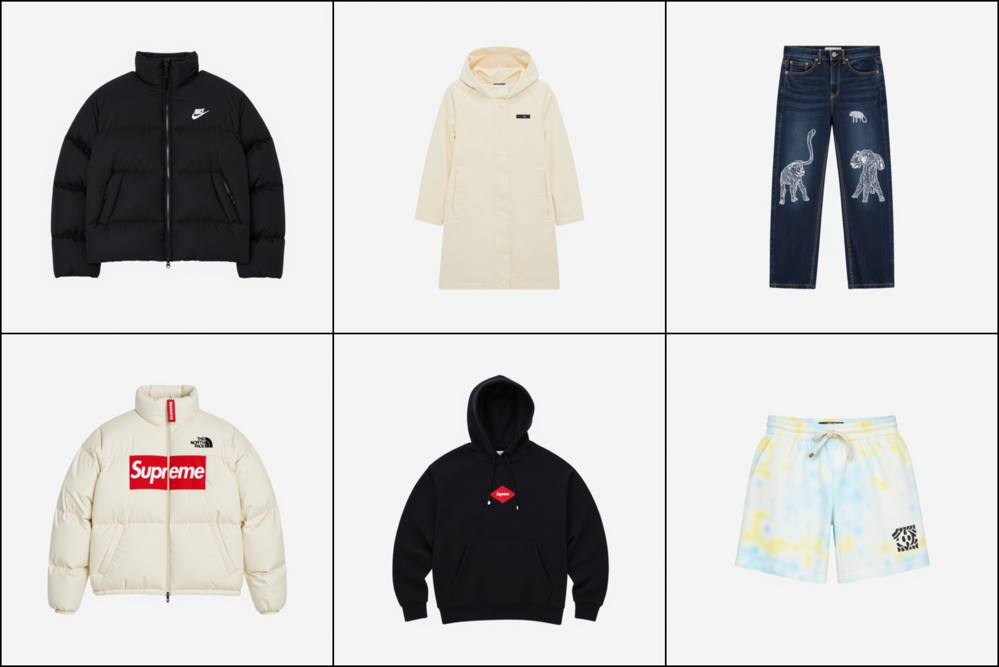
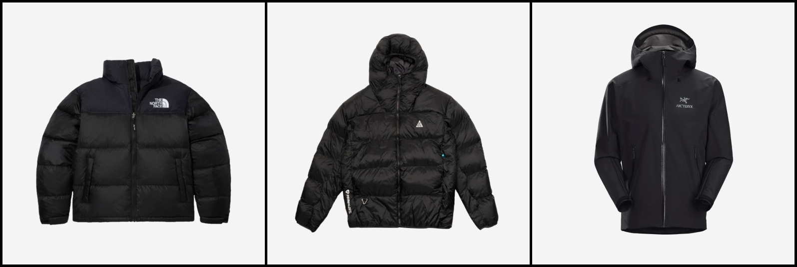

# Fashion is My Profession (FiMP)

**FiMP** -- Fashion product generator based on `Flux.1-[dev]` is a fine-tuned generative text-to-image generative model using [fashion product dataset](https://huggingface.co/datasets/hahminlew/kream-product-blip-captions) collected on KREAM, one of the best online marketplaces in Korea.

We improved the original dataset image captions by replacing the BLIP model for automatic captioning with `Qwen2-VL-7B-Instruct`.

**Hugging Face Repository**
- Model (ours): [Murmisov/Flux.1-dev-kream-lora](https://huggingface.co/Murmisov/Flux.1-dev-kream-lora)
- Base Model (ours): [Murmisov/Flux.1-dev-kream-lora-enhanced](https://huggingface.co/Murmisov/Flux.1-dev-kream-lora-enhanced)
- Previous solution: [Fashion-product-generator](https://github.com/hahminlew/fashion-product-generator)

## Qualitative results

Examples of generation by our best model ([Murmisov/Flux.1-dev-kream-lora-enhanced](https://huggingface.co/Murmisov/Flux.1-dev-kream-lora-enhanced)).



`Prompts`
- `outer, The Nike x Balenciaga Down Jacket Black, a photography of a black down jacket with a logo on the chest.`
- `top, (W) Moncler x Adidas Slip Hoodie Dress Cream, a photography of a cream dress and a hood on.`
- `bottom, Supreme Animal Print Baggy Jean Washed Indigo - 23FW, a photography of a dark blue jean with an animal printing on.`
- `outer, The North Face x Supreme White Label Nuptse Down Jacket Cream, a photography of a white puffer jacket with a red box logo on the front.`
- `top, The Supreme x Stussy Oversized Cotton Black Hoodie, a photography of a black shirt with a hood on and a logo on the chest.`
- `bottom, IAB Studio x Stussy Tie-Dye Sweat Wooven Shorts, a photography of a dye short pants with a logo.`

### Installing Dependencies

Please refer to [requirements.txt](./requirements.txt) for more details.
```bash
pip install -r requirements.txt
```

## KREAM Product Dataset from Hugging Face

[KREAM Product Blip Captions Dataset](https://huggingface.co/datasets/hahminlew/kream-product-blip-captions).

```python
from datasets import load_dataset

dataset = load_dataset("hahminlew/kream-product-blip-captions", split="train")
samples = dataset[:3]

display(create_img_grid(samples['image']))
print(f"--------------------------------------------")
for i, text in enumerate(samples["text"], start=1):
    print(f"№{i} : {text}")
```



```
№1 : outer, The North Face 1996 Eco Nuptse Jacket Black, a photography of the north face black down jacket
№2 : outer, Nike ACG Therma-Fit ADV Lunar Lake Puffer Jacket Black - Asia, a photography of a black jacket with a hood and a zipper
№3 : outer, Arc'teryx Beta LT Jacket Black, a photography of a black jacket with a hood on
```

### Enhanced captions

Enhanced captions are in the csv file [enhanced_captions.csv](https://drive.google.com/drive/folders/1hdeY1CT1fiLONqZTcS1jPhLI8QMBUWXD?usp=sharing). We ...

```python
import pandas as pd
dataframe = pd.read_csv("./data/enhanced_captions.csv")
caption_mapping = dict(zip(dataframe["original_caption"], dataframe["enhanced_caption"]))

def update_caption(example):
    image_id = example['text']
    example['text'] = example['text'].split(', a photography of')[0] + ". " + caption_mapping[image_id]
    return example

extended_dataset = dataset.map(update_caption)

samples = extended_dataset[:3]

display(create_img_grid(samples['image']))
print(f"--------------------------------------------")
for i, text in enumerate(samples["text"], start=1):
    print(f"№{i} : {text}")
```


```
№1 : outer, The North Face 1996 Eco Nuptse Jacket Black. The North Face 1996 Eco Nuptse Jacket is a black puffer jacket with a high collar and a front zipper closure. The jacket features the North Face logo on the left side of the chest and has a quilted design throughout. It is made of a durable and insulated material, making it perfect for cold weather.
№2 : outer, Nike ACG Therma-Fit ADV Lunar Lake Puffer Jacket Black - Asia. The image features a Nike ACG Therma-Fit ADV Lunar Lake Puffer Jacket in black. This jacket is designed with a quilted, puffer-style construction, providing insulation and warmth. It has a hood, a front zipper closure, and appears to be made from a durable, water-resistant material. The jacket also includes branding elements, such as the Nike ACG logo on the left chest area and a small emblem on the right sleeve.
№3 : outer, Arc'teryx Beta LT Jacket Black. This image has the following item: 'outer, Arc'teryx Beta LT Jacket Black'.
```

## Finetuning Instructions

We utilized `Hugging Face Diffusers Dreambooth and LoRA Examples` for finetuning a pre-trained Flux.1-[dev] with [LoRA](https://github.com/cloneofsimo/lora) under 8 NVIDIA H100 80GB GPUs. 
- Memory-Usage: approximately 71 GB per GPU
- Training-Time: approximately 7h for 15 epochs

Before finetuning (on enhanced caption) you need to download the csv file [enhanced_captions.csv](https://drive.google.com/drive/folders/1hdeY1CT1fiLONqZTcS1jPhLI8QMBUWXD?usp=sharing) and put it in the `/data` folder.

```bash
export MODEL_NAME="black-forest-labs/FLUX.1-dev"
export DATASET_NAME="hahminlew/kream-product-blip-captions"
export OUTPUT_DIR="./flux-dev-kream-lora-enhanced-captions"

accelerate launch --config_file "./finetuning/accelerate_config.yaml" ./finetuning/train_dreambooth_lora_flux.py \
  --pretrained_model_name_or_path=$MODEL_NAME  \
  --dataset_name=$DATASET_NAME --caption_column="text" --image_column="image" \
  --enhanced_prompts="./data/enhanced_captions.csv" \
  --output_dir=$OUTPUT_DIR \
  --mixed_precision="bf16" \
  --instance_prompt=None \
  --resolution=1024 \
  --random_flip \
  --train_batch_size=1 \
  --guidance_scale=1 \
  --gradient_accumulation_steps=1 \
  --optimizer="prodigy" \
  --learning_rate=1. \
  --report_to="tensorboard" \
  --lr_scheduler="constant" \
  --lr_warmup_steps=0 \
  --num_train_epochs=15 --checkpointing_steps=1800 \
  --validation_prompt="outer, The Nike x Balenciaga down jacket black, a photography of a black down jacket with a logo on the chest" \
  --validation_epochs=1 \
  --rank=128 \
  --seed="42" \

```
or simply run:

```bash
./finetuning/run.sh
```

## Inference

[Murmisov/Flux.1-dev-kream-lora](https://huggingface.co/Murmisov/Flux.1-dev-kream-lora) and [Murmisov/Flux.1-dev-kream-lora-enhanced](https://huggingface.co/Murmisov/Flux.1-dev-kream-lora-enhanced) are now available in Hugging Face 🤗.

For inference you can use the code from jupyter notebook [inference.ipynb](./inference.ipynb).

**Usage**

```python
from diffusers import DiffusionPipeline
import torch

pipe = DiffusionPipeline.from_pretrained("black-forest-labs/FLUX.1-dev", torch_dtype=torch.float16)
pipe.to("cuda")

pipe.load_lora_weights("Murmisov/Flux.1-dev-kream-lora-enhanced")

prompt = "outer, The Nike x Balenciaga Down Jacket Black, a photography of a black down jacket with a logo on the chest."

image = pipe(prompt, num_inference_steps=45, guidance_scale=7.5).images[0]
image.save("example.png")
```

**Parameter Descriptions**
- `num_inference_steps`: int, Number of diffusion steps
- `guidance_scale`: float, How similar the generated image will be to the prompt, 1 <= `guidance_scale` <= 50

## References
- Orginal Model: [hahminlew/sdxl-kream-model-lora-2.0](https://huggingface.co/hahminlew/sdxl-kream-model-lora-2.0)
- Dataset: [hahminlew/kream-product-blip-captions](https://huggingface.co/datasets/hahminlew/kream-product-blip-captions)
- Automatic captioning: [Qwen/Qwen2-VL-7B-Instruct](https://huggingface.co/Qwen/Qwen2-VL-7B-Instruct)
- [Hugging Face Diffusers Dreambooth and LoRA Examples](https://github.com/huggingface/diffusers/blob/main/examples/dreambooth/train_dreambooth_lora_flux.py)


## Citation

```
@misc{lew2023kream,
      author = {Lew, Hah Min},
      title = {KREAM Product BLIP Captions},
      year={2023},
      howpublished= {\url{https://huggingface.co/datasets/hahminlew/kream-product-blip-captions/}}
} 
```
